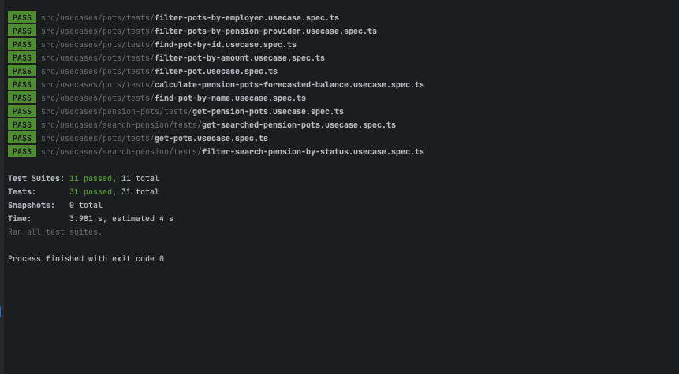

# Mintago Pension API 📊💼

## Table of Contents

- [Overview](#overview)
- [Technologies Used](#technologies-used)
- [Folder Structure](#folder-structure)
- [Installation and Setup](#installation-and-setup)
- [Running the Application](#running-the-application)
- [Database Options](#database-options)
- [API Documentation](#api-documentation)
- [Endpoints](#endpoints)
- [Error Handling](#error-handling)
- [Environment Variables](#environment-variables)
- [Testing](#testing)
- [Known Issues](#known-issues)

---

## Overview 🚀

Mintago Pension API provides endpoints to manage and retrieve pension pots and search pension data. It includes functionality for querying and filtering pension pots by name, amount, employer, and pension provider. The API also supports calculating a pension pot's forecasted balance based on interest rates and monthly payments. This API can run on **Supabase** or **JSON** file data, determined by the selected data source in the environment configuration.

## Technologies Used 🛠️

- **Node.js** (JavaScript runtime)
- **NestJS** (Framework for building scalable server-side applications)
- **TypeScript** 
- **Supabase** 
- **Throttler** (Request rate-limiting)
- **Jest** (Testing framework)
- **Swagger** (API Documentation)
- **Dotenv** (Managing environment variables)

---

## Folder Structure 📁

```bash
├── README.md
├── nest-cli.json
├── package.json
├── src
│   ├── app.controller.ts                # Base app controller
│   ├── app.module.ts                    # Main module definition
│   ├── app.service.ts                   # Base app service
│   ├── domain                           # Domain layer containing models and repositories
│   │   ├── adapters                     # Interfaces for service and response patterns
│   │   ├── config                       # Interfaces for environment configuration
│   │   ├── logger                       # Logger interfaces
│   │   ├── models                       # Domain models (PensionPotModel, SearchedPensionModel)
│   │   └── repositories                 # Interfaces for repositories (CRUD operations)
│   ├── infrastructure                   # Infrastructure layer for controllers, services, and repositories
│   │   ├── common                       # Common utilities (helpers, DTOs, exceptions)
│   │   ├── config                       # Configuration for environment and database (Supabase)
│   │   ├── controllers                  # API controllers for pension-related endpoints
│   │   ├── entities                     # (Optional) entities if using Supabase
│   │   ├── graphql                      # (Optional) GraphQL integration if needed
│   │   ├── logger                       # Logging implementation and service
│   │   ├── repositories                 # Repository implementations (Supabase/JSON)
│   │   ├── services                     # Application services handling business logic
│   │   └── usecase-proxy                # Use case proxies for dependency injection
│   ├── main.ts                          # Entry point of the application
│   └── usecases                         # Use case definitions for business logic
│       ├── pension-pots                 # Use cases for handling pension pots
│       ├── pots                         # Additional use cases for pot filtering and calculations
│       └── search-pension               # Use cases for managing searched pensions
└── test                                 # Test files for unit and e2e tests
```

---

## Installation and Setup ⚙️

To get started with the Mintago Pension API, follow the steps below:

1. **Clone the Repository:**

   ```bash
   git clone https://github.com/toluwaanimi/mintago-api.git
   cd mintago-api
   ```

2. **Install Dependencies:**

   You can use `npm` or `yarn` to install the necessary packages:

   ```bash
   npm install
   # or
   yarn install
   ```

3. **Environment Setup:**

   Create a `.env` file in the root directory with the following variables:

   ```bash
   PORT=3000
   NODE_ENV=development
   DATASTORE=supabase
   SUPABASE_URL=https://your-supabase-url
   SUPABASE_KEY=your-supabase-api-key
   ```

   **Note:** The `DATASTORE` can be set to either `local` or `supabase` depending on the database you want to use.

4. **Run the Application:**

   ```bash
   npm run start:dev
   ```

---

## Running the Application ▶️

Once the setup is complete, you can start the API server using the following commands:

- **Development Mode:**

  ```bash
  npm run start:dev
  ```

- **Production Mode:**

  ```bash
  npm run build
  npm run start
  ```

- **Testing:**

  To run unit tests:

  ```bash
  npm run test
  ```

---

## Database Options 🗄️

The application supports two data sources:

1. **Supabase**: A fully managed backend-as-a-service (BaaS) providing a Postgres database.
2. **JSON File**: A local JSON file that contains pension and searched pension data.

You can configure which datastore to use by setting the `DATASTORE` environment variable in your `.env` file:

- **Supabase**: Set `DATASTORE=supabase`.
- **JSON File**: Set `DATASTORE=local`.

The application will automatically select the appropriate repository (Supabase or JSON-based) depending on the datastore chosen.

---

## API Documentation 📜

Swagger is integrated into the project to provide detailed API documentation and interactive testing for the available endpoints.

- Swagger URL: `http://localhost:3000/docs`

---

## Endpoints 📡

Below is a comprehensive list of the available endpoints and how to use them.

### Pension Pot Endpoints

| Method | Endpoint                          | Description                                           | Query Params / Body                   |
|--------|-----------------------------------|-------------------------------------------------------|---------------------------------------|
| `GET`  | `/pensions`                       | Retrieve all pension pots                             | None                                  |
| `GET`  | `/pots`                           | Retrieve pension pots with various filters            | `name`, `employer`, `provider`, `amount`, `direction` |
| `GET`  | `/pots/:id`                       | Retrieve a specific pension pot by ID                 | None                                  |
| `POST` | `/pots/balance`                   | Calculate pension pot balance after a given number of years | `{ "year": number }`                |

### Search Pension Endpoints

| Method | Endpoint                          | Description                                           | Query Params / Body                   |
|--------|-----------------------------------|-------------------------------------------------------|---------------------------------------|
| `GET`  | `/pension-pots/search`            | Retrieve all searched pension pots                    | None                                  |
| `GET`  | `/pension-pots/search/status`     | Retrieve searched pension pots filtered by status      | None                                  |

---

### Example API Requests 📩

**1. Get all Pension Pots:**

```bash
curl -X GET "http://localhost:3000/pensions"
```

**2. Get Pension Pots by Employer:**

```bash
curl -X GET "http://localhost:3000/pots?employer=Google"
```

**3. Calculate Pension Pot Forecasted Balance:**

```bash
curl -X POST "http://localhost:3000/pots/balance" -d '{ "year": 5 }'
```

---

## Error Handling ⚠️

The API uses structured error handling to manage exceptions and provide meaningful feedback to the client.

### Common Error Responses:

- **400 Bad Request**: Returned when a required parameter is missing or invalid.
- **404 Not Found**: Returned when a requested resource (pension pot or searched pension) is not found.
- **500 Internal Server Error**: Returned for any unexpected errors in the server.

Example Error Response:

```json
{
  "status": false,
  "message": "Pension pot not found"
}
```

---

## Environment Variables 🌍

The following environment variables are used in the project:

| Variable        | Description                                           | Default Value |
|-----------------|-------------------------------------------------------|---------------|
| `PORT`          | Port number on which the server will run              | `3000`        |
| `NODE_ENV`      | Node environment (development, production)            | `development` |
| `DATASTORE`     | Choose between `local` or `supabase` as the datastore | `local`       |
| `SUPABASE_URL`  | URL for Supabase database connection                  | -             |
| `SUPABASE_KEY`  | API Key for Supabase                                  | -             |

---

## Testing 🧪

The project uses **Jest** for testing. You can find the tests in the `src/usecases/**/tests` directory. Both unit tests are provided.

### Running Tests:

```bash
npm run test
```


You can view coverage by running:

```bash
npm run test:cov
```

---

## Known Issues 🐛

- Currently, the API supports filtering by a limited set of fields. Future improvements could include adding more dynamic search options and pagination.
- The API does not support updating or deleting pension pots. This could be added in future iterations.
- The API does not support user authentication or authorization. This could be added for more secure access to pension data.

## Future Improvements ✨

- Add **pagination** support for retrieving large sets of pension pots.
- Implement **GraphQL** endpoints for more flexible querying.
- Enhance **logging** for better traceability of API usage.

---

## Conclusion 💡

The Mintago Pension API is a robust system for handling pension data, supporting both Supabase and JSON-based data storage. With flexible filtering, forecast calculation, and clear error handling, it’s built to manage and retrieve pension information efficiently.

For more information, refer to the Swagger documentation available at `http://localhost:3000/docs`.

